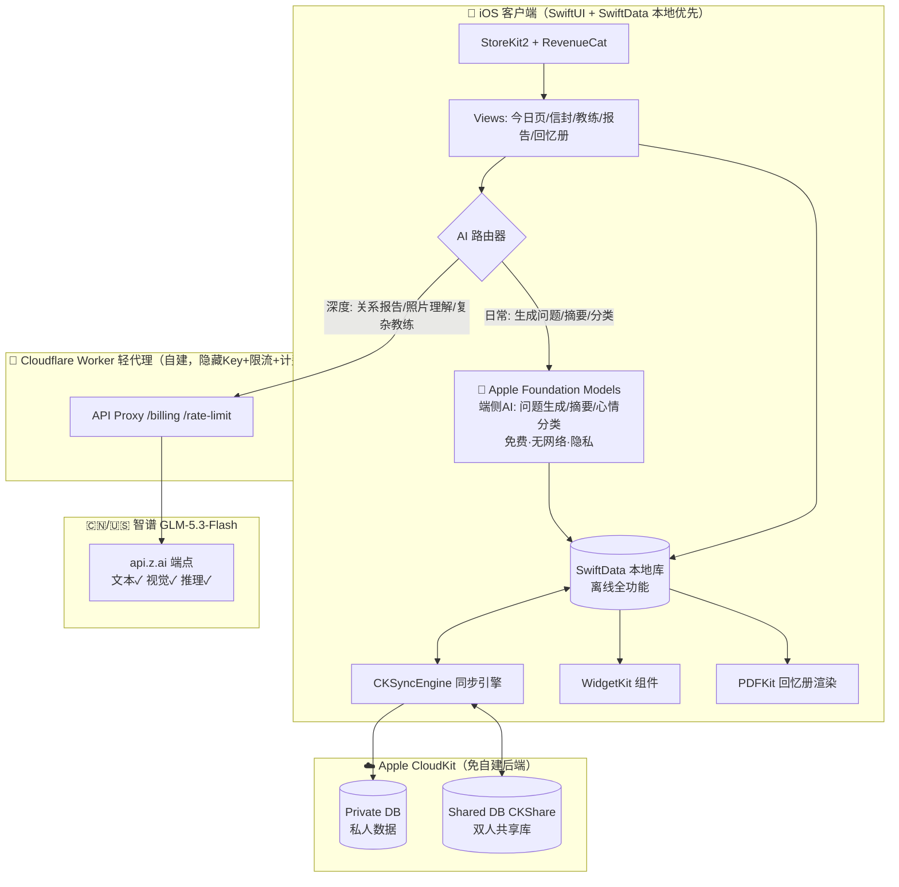
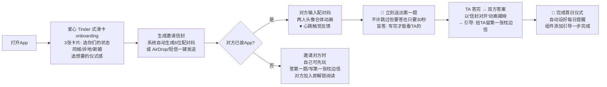
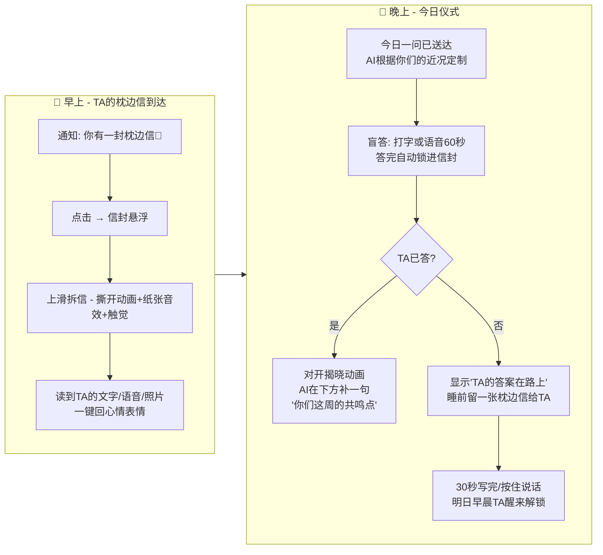
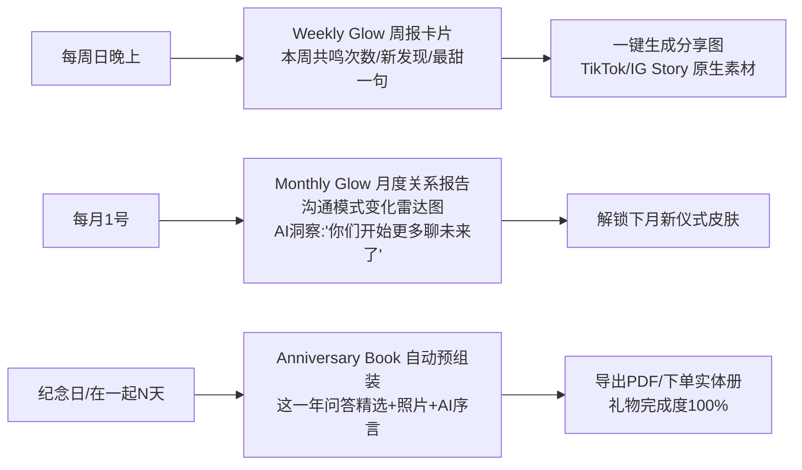
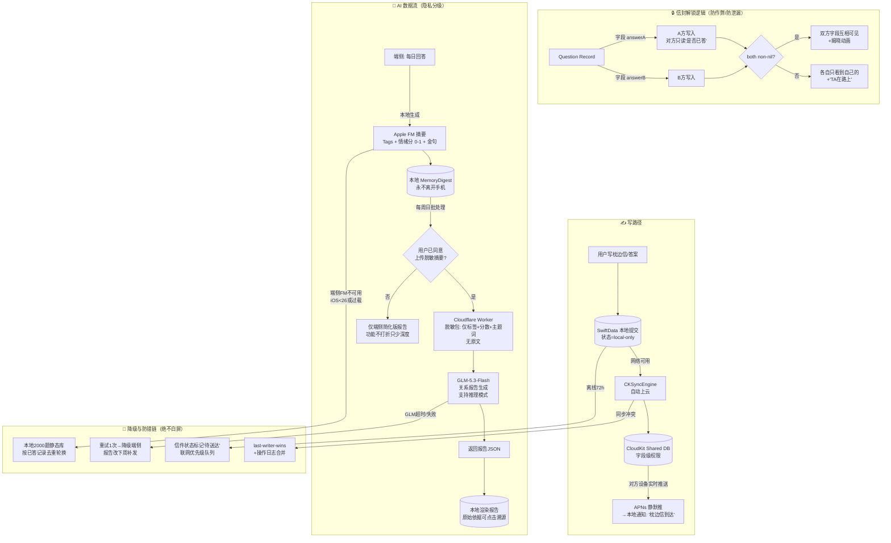

# TR-20260916-枕边信Pillownote情侣App操作指南

> **本文档用途**：任何 LLM / 开发者 拿到本文档后，可完整复刻一款在美国市场具备碾压级竞争优势的 iOS 情侣 App。
> **复刻对象**：Flamme（情侣每日一问 + AI 关系教练，8个月 $3K→$10K MRR，25万下载，TikTok 5000万+播放）
> **策略**：复刻核心模式 + 针对其已验证痛点做二次开发碾压升级
> **生成日期**：2026-09-16 ｜ **调查方法**：pain-point-hunter SKILL（Reddit/竞品差评/定价取证）+ GitHub MCP 开源调研 + sequential-thinking 结构化推演

---

# 〇、APP 命名与副标题（本软件身份，最优先）

## 0.1 最终命名

| 项目 | 内容 |
|---|---|
| **App 名称** | **Pillownote** |
| **副标题（Subtitle，30字符内）** | Daily Questions for Couples |
| **推广短句（营销语）** | "Leave a note on their pillow, from anywhere."（在任何地方，给TA的枕边留一张字条） |
| **关键词（Keywords，100字符内）** | couple,daily question,relationship,love note,long distance,anniversary,partner,quiz,us,together |
| **类别** | Lifestyle（生活方式） |
| **年龄分级** | 12+（含亲密话题讨论） |

## 0.2 命名深度分析（五维度）

### ① ASO 搜索优化
- "pillow note" 意象直白，无歧义拼写（pillow + note 两个高频英文词），用户听一遍就会拼、会搜。
- 副标题承载核心搜索词 "Daily Questions for Couples"——这是美国区月搜索量最高的情侣类意图词（Paired/Flamme/Evergreen 三家主战场），品牌词+品类词双保险。
- 独创词在 App Store 搜索结果中可 100% 占位，零竞品分流。

### ② 品牌记忆度（最关键）
- **画面感即记忆**：pillow note（枕边字条）是全人类共通的情感意象——睡前给爱人留一张字条，TA 醒来在枕边发现。一个词讲清了产品的核心场景（异步留言），不需要解释。
- **可动词化**（病毒传播的顶级特征）：`"I pillownoted you last night"` / `"Did you check your pillownote?"`——产品名直接变成情侣间的日常用语，语言即传播。
- **TikTok 原生梗**：`we pillownote every night 💌` 天然是短视频标题和 hashtag（#pillownote），对标 Flamme 靠 TikTok 5000万播放起盘的路径，梗感更强。
- 10 字母、三个音节、双写 l 视觉稳定，App 图标用「一枚信封放在枕头上」即可讲完品牌。

### ③ 功能描述性（很关键）
- 名字直接描述 #1 差异化功能（异步枕边便签 Pillow Note），用户看到名字即知用途——符合 Sober Tracker 案例验证的方法论："Name the app what people actually do, not a clever brand name"。

### ④ 情感共鸣
- 「枕边」= 最私密、最亲密的空间；「字条」= 手写温度、慢节奏浪漫。与竞品 Paired（配对，冷）、Evergreen（常青树，泛）、Between（之间，抽象）相比，情感浓度最高，且天然契合异地恋（LDR）人群——美国 LDR 情侣约 1400万对，是被验证的高传播高付费人群。

### ⑤ 国际化适配
- pillow / note 在英语、西语（almohada/nota 概念直译）、葡语、德语（Kissenbrief 文化近似）中无负面谐音；发音对所有语言使用者友好（无 th/r 卷舌等难音）。
- 域名建议：pillownote.app（.app 域名即信任背书）。

### ⑥ 查重结论（重要合规说明）
- **已排除的撞名候选**：Emberly（App Store 已有 5+ 同名App）、Dovely（已有 Bible in a Year + Time for Two）、Waffle/Letterly/Tandem/Amorno（已有产品）。
- **Pillownote 初查无 App Store 同名冲突**（2026-09-16 全网检索，仅存在无关的同名舞蹈评论栏目）。⚠️ 上架前必须在 App Store Connect 的名称搜索框做最终确认（以 Apple 实时库为准），若被占启用备选名。
- **备选名（同样已初查无冲突）**：Amorly（amor=爱 + ly，品牌感强）、Heartpost（心的邮局）、Dawnnote（黎明字条）。若主名被占，按 1) Pillownote 2) Heartpost 3) Amorly 顺序启用。

---

# 一、竞品深度分析（复刻对象 Flamme + 全格局）

## 1.1 竞品格局总表（2026-09 实测）

| 竞品 | 定价 | 核心功能 | 已验证缺陷 |
|---|---|---|---|
| **Flamme**（复刻对象） | 免费+ $11.99/月 或 $39.99/年 | 每日一问、1000+ quiz、组件（付费）、AI教练 Duo AI/LDR Buddy/Date Planner（付费）、bucket list | AI 只看单条回答缺长期记忆；问题库重复率高；组件等基础功能要付费；无回忆沉淀出口 |
| **Paired** | 免费+ 订阅（约$69.99-99/年） | 800万下载，每日对话+专家内容库+journeys | 差评："过度聚焦身体亲密"；内容墙高 |
| **Evergreen** | 免费+ $9.99/月 或 $49.99/年 | 颜值高，每日问题+check-in+课程 | 差评：**内容约3天就开始重复，第3天起大面积付费墙** |
| **Couply** | 免费+ $15/月 或 $69.99/年 | quiz/游戏/课程/约会点子 | 价格最高档之一 |
| **Relish** | ~$99.99/年 | 真人教练 | 贵，凌晨2点没人在线 |
| **Gottman Card Decks** | **完全免费** | 14套卡组 1000+ 问题（数十年研究） | 无互动闭环（纯闪卡）——**它免费，意味着"静态问题库"本身不值钱，值钱的是围绕问题的互动与记忆** |
| **Between / Agapé** | 免费+内购 | LDR 私密空间/时间线 | 功能杂，AI 能力为零 |
| **OurCouple / Connected / Amorno / Tethered**（新势力） | 免费+订阅 | async-first：倒计时+时区提醒+每日仪式 | 全部无 AI 记忆、无报告、无回忆册；同质化混战 |
| **CoupleBee** | 免费+订阅 | **盲答**（双方答完才互相可见）+共享时间线 | 单点功能，生态弱 |
| **SumOne** | 免费+内购 | 每日一问游戏 | 差评：问题重复且泛、崩溃多、内购贵 |

## 1.2 全类目差评取证（pain-point-hunter 输出，保留用户原话）

> **痛点一：内容重复，长期用户流失**
> "The recurring complaint in reviews is that content starts repeating fairly quickly and most of it sits behind a paywall from about day three."（Evergreen 评测原文：内容约3天就开始重复，且大部分从第3天起被锁进付费墙）
> "🤖 Repetitive and generic questions"（SumOne 差评高频词：问题重复且空泛）

> **痛点二：订阅贵 + 欺骗性订阅是全类目差评第一大来源**
> "💰 Expensive subscription / 🔒 Paywall blocks free access"（Evergreen/Flamme 类目差评标签）
> "They force you to buy a subscription to use the app 😭"（同赛道戒断类目用户原话，情侣类同样适用）

> **痛点三：互动需要"精力"——产品的隐性使用门槛**
> "A lot of couples apps (including Flamme / Paired) are good at giving content, but they still assume you have the energy to engage with it."（Reddit r/iOSAppsMarketing：这些App只管给内容，却默认你有精力去完成它）——**这是比"功能缺失"更深的产品洞察：把每日互动做重了，用户累，关系变成了作业。**

> **痛点四：AI 教练没有长期记忆（复刻对象刚补课）**
> Flamme 官方在 Product Hunt 承认 2025 年才给 AI 加 memory（"We just gave our AI a memory"）。竞品 AI 普遍只看单条回答，给不出"我们这一年怎么变化的"洞察。

> **痛点五：LDR 异步已成标配但无情感深度**
> "Wake up to their love note every morning."（OurCouple 营销语）；"Async communication in a relationship isn't a compromise. It's a different kind of intimacy."（Sharing Me 博客）——异步是入场券，但现有产品只有"消息"，没有"仪式感"和"沉淀"。

> **痛点六：回忆无出口，数据只是流水**
> 每日问答积累的是两个人最珍贵的语言，但没有任何头部产品提供"周年回忆册导出"——数据锁死在 App 里，用户换机/退订即蒸发（这也让用户不敢深度投入）。

> **痛点七：隐私是情侣内容的死穴**
> "Couple conversations are personal. The platform should feel like a private space, not a social network where your relationship is ambient content."（Roads Audio）——情侣对话比日记更私密，隐私架构必须是卖点而非脚注。

## 1.3 痛点评级（pain-point-hunter 评分体系）

| 痛点 | 具体性25% | 独特性20% | 可实现20% | 付费性20% | 规模15% | 总分 | 结论 |
|---|---|---|---|---|---|---|---|
| P1 内容重复→AI动态生成 | 22 | 18 | 18 | 16 | 13 | **87 🥇** | 主打功能 |
| P2 订阅黑箱→透明定价 | 24 | 19 | 20 | 15 | 13 | **91 💎** | 定价+营销双杠杆 |
| P3 精力门槛→30秒仪式 | 23 | 18 | 19 | 14 | 13 | **87 🥇** | 核心交互设计原则 |
| P4 AI无记忆→双AI记忆 | 21 | 18 | 16 | 17 | 12 | **84 🥇** | 付费核心理由 |
| P5 LDR异步→信封仪式 | 22 | 14 | 19 | 15 | 13 | **83 🥇** | 免费档钩子 |
| P6 回忆无出口→周年册 | 23 | 18 | 17 | 18 | 12 | **88 🥇** | 付费+情感商品 |
| P7 隐私→端侧优先 | 21 | 16 | 17 | 12 | 12 | **78 🥈** | 架构原则+信任营销 |

**综合评级：💎 85/100（金级偏上，立即行动）**——付费意愿已验证（Flamme $10K MRR），痛点全部可工程化解决，MVP 3周可交付，且与"透明定价"全局红利（报告核心发现#3）完美共振。

---

# 二、GitHub 二次开发调研（可用的开源项目与技术）

> 调研方法：GitHub MCP 全库检索（couples app / relationship / swiftui / cloudkit / foundation models / revenuecat 等 8 组查询交叉）

## 2.1 可直接借鉴的项目

| 项目 | 技术栈 | 可复用价值 | 许可注意 |
|---|---|---|---|
| **EvilIrving/between-us** | iOS 原生，"two people leave words, photos, and voice notes in shared vessels, not a chat timeline" | **产品形态级参考**：两人共写"容器"而非聊天时间线——正是 Pillow Note 信封模式的同构实现；2026-09 仍在活跃更新 | 二开前查 LICENSE |
| **Fearplay/couplefy** | 在一起天数/name-day/每日格言，自定义背景+深浅色 | 天数计数器 + 组件的实现参考（我们免费送的功能） | 查 LICENSE |
| **Temp1258/PoopHub** | 情侣专属 iOS App：表情推送、每日仪式、时间胶囊、加密备份（RN+Expo） | 「时间胶囊」（延迟解锁）与「每日仪式」两个机制的功能设计参考；加密备份思路 | 查 LICENSE |
| **IvanCampos/Foundation-Models-Playgrounds** | Swift，Apple **Foundation Models framework** 官方示例集 | **核心技术参考**：`LanguageModelSession` 用法、`@Generable` 引导式生成（结构化产出问题/摘要）、流式输出 | 学习用途 |
| **artypeace/SwiftUI-Onboarding-Animation-PayWall-RevenueCat** | SwiftUI onboarding + 彩带动画 + RevenueCat 付费墙 | 付费墙与 onboarding 动效模板（转化率关键路径） | 查 LICENSE |
| **gokhanamal/IndieBuilderKit** | Swift 独立开发者工具箱 | 订阅/组件/通用基建参考 | 查 LICENSE |
| **Crewrafa/fingether** | SwiftUI + Supabase + Claude API 情侣财务App | 「LLM + 情侣场景」的 API 编排参考 | 专有许可，仅学习思路 |

## 2.2 官方/权威技术底座（无许可风险，优先使用）

1. **CloudKit CKSyncEngine + Shared Database（CKShare）**：Apple 原生"两人私有共享库"，免自建后端、免用户账号体系（Apple ID 即登录）、传输与存储端到端加密——同时解决「后端成本」和「隐私叙事」两大问题。
2. **Apple Foundation Models framework（iOS 26+）**：端侧 ~3B 模型，**免费、无网络、无调用费**——用于每日问题生成、回答摘要、心情分类，构成"Apple AI 无限免费用"的差异化基石（small account 开发者账号即可用）。
3. **StoreKit 2 + RevenueCat SDK**：订阅管理、跨设备恢复、A/B 定价。
4. **SwiftData**：本地优先存储（离线全功能可用，同步只做增强）。
5. **WidgetKit + App Intents**：锁屏/桌面组件（倒数日、今日一问、对方心情）。
6. **PDFKit + UIGraphicsPDFRenderer**：周年回忆册本地导出。

---

# 三、产品定义：Pillownote 六层价值栈

> 设计总纲：**每一个功能都精准打在一条已验证痛点上，且把竞品的付费点变成我们的免费点。**

| 层 | 功能 | 打击的痛点 | 对比竞品 |
|---|---|---|---|
| L1 | **Pillow Note 枕边信**：睡前 30 秒留一张字条（文字/语音/照片），对方醒来"拆信封"解锁 | P3精力门槛 + P5异步 | 竞品无此仪式感；语音留言零打字负担 |
| L2 | **Daily Spark 每日一问（AI 动态生成）**：永不重复；**盲答机制**（双方答完才互相可见） | P1重复 | 静态题库竞品必然重复；Gottman 免费卡组无法互动 |
| L3 | **Coach 关系教练（双 AI 长期记忆）** | P4无记忆 | Flamme AI 单轮回答；我们记得"你们这一年" |
| L4 | **Monthly Glow 月度关系报告**：沟通模式/新发现/关系温度可视化 | P4 + P6 | **全类目独家**，天然朋友圈/TikTok 分享物 |
| L5 | **Anniversary Book 周年回忆册**：一键导出精排 PDF（可选实体印刷） | P6回忆无出口 | **全类目独家**；把数据变成情感商品 |
| L6 | **Widgets 组件全家桶（全免费）**：在一起天数/异地倒计时/今日一问/TA的心情 | P5 + 价格感知 | **Flamme 组件是付费功能，我们免费**——直接碾压点 |

**免费档"真有用"原则**（打 P2）：免费档可无限期使用每日一问（盲答）+ 每天 1 张枕边信 + 全部组件——对比 Evergreen "第3天上墙"，我们是口碑引擎。

---

# 四、实现流程图（系统架构）



**架构决策说明**：
- **本地优先（Local-first）**：无网可用全功能，CloudKit 只做同步增强——情侣在电梯里、飞机上、凌晨没信号时依然能写信。
- **双 AI 混合路由**：端侧 Apple AI 处理 90% 高频调用（免费、瞬时、隐私），云侧 GLM-5.3-Flash 只处理"值得深度"的 10%（月度报告、照片理解、复杂情感推理）——成本可控、体验分级。
- **无自有重后端**：CloudKit 承担数据，Cloudflare Worker（免费额度内）只做 GLM 代理，运维成本≈0，毛利极高。

---

# 五、用户使用流程图（极端重要：90秒上手，爽文级体验）

> 设计宗旨：**3 屏开始用、每次打开必有一个"值得期待的小惊喜"、永远不用读教程。**

## 5.1 首次启动（目标：<90秒进入第一次互动）



**爽点设计**：onboarding 没有注册表单（Apple ID 静默）、没有权限轰炸（通知在第3天习惯养成后才请求）、首屏 30 秒内必有一次"盲答揭晓"的期待感释放。

## 5.2 日常循环（每天 2 次打开，每次 30-60 秒）



**爽点设计**：
- **拆信封是每日多巴胺**：撕纸动画 + 音效 + Haptic，把"看消息"升级为"拆礼物"（人性化的仪式感，直接对抗 Reddit 痛点"没精力互动"——拆信不费精力，是期待）。
- **语音优先**：按住说话即自动转文字+保留原声，床上闭眼也能完成，零打字负担。
- **永远有钩子**：TA 还没答时显示倒计时/TA正在写的心跳动画，制造轻期待而非焦虑。

## 5.3 周期性高潮点（留存与传播）



---

# 六、软件数据流图（极端重要：真实、可靠、防翻车）

> 设计铁律：**不虚假**——所有 AI 洞察必须可追溯（点开能看到依据的原始对话）；**不丢数据**——本地优先+双端云备份；**不越隐私线**——原文永不出端侧（除用户明确同意的脱敏摘要）。

## 6.1 核心数据流（写路径 + 读路径）



## 6.2 数据模型（SwiftData 核心实体）

```swift
// Question: 每日一问
@Model final class Question {
    var id: UUID
    var text: String              // 问题文本（AI生成或题库）
    var category: String          // intimacy/future/fun/deep/emoji-day
    var source: QuestionSource    // .onDeviceAI / .cloudAI / .staticBank
    var myAnswer: Answer?         // 我的答案（含语音本地文件引用）
    var partnerAnswerShared: CKRecord.Reference? // 对方答案（共享库引用）
    var assignedUTC: Date         // UTC 分发时间
    var myTZ: String, partnerTZ: String // 双时区
}
// PillowNote: 枕边信
@Model final class PillowNote {
    var id: UUID
    var kind: NoteKind            // text/voice/photo
    var bodyEncrypted: Data       // 端侧加密后密文
    var voiceDuration: TimeInterval?
    var createdInTZ: String
    var unlockAtUTC: Date         // 对方当地 07:00 解锁
    var openedAt: Date?
    var reaction: String?         // 心情表情
}
// MemoryDigest: 端侧记忆（AI教练的长期记忆底座）
@Model final class MemoryDigest {
    var day: Date
    var tags: [String]            // ["future","work-stress","travel-plan"]
    valence: Double               // 情绪分 -1…1
    var highlight: String         // 金句（本地）
    var uploadedConsent: Bool     // 是否同意脱敏上传
}
```

## 6.3 可靠性设计清单（逐条对应竞品翻车点）

| 风险 | 方案 | 对应竞品教训 |
|---|---|---|
| AI 生成失败/白屏 | 三级降级：端侧FM→静态题库去重轮换→"回忆模式"（重看历史高赞题） | Flamme 曾有"每日问题加载失败"更新记录 |
| 双方答案竞态 | CloudKit 字段级写入 + both-non-nil 解锁，无自建服务器的原子性问题 | — |
| 时区错乱 | 全库 UTC 存储 + 双端各显本地时间；解锁时间=**对方当地早晨7:00** | LDR 类产品差评重灾区 |
| 同步冲突 | CKSyncEngine 官方冲突策略 + 本地操作日志 | — |
| GLM Key 泄漏 | Key 只存 Cloudflare Worker Secret，App 永不持有；Worker 做限流+滥用检测 | — |
| 数据可携 | 设置页"一键导出全部数据"（JSON+照片zip）+ 注销即焚 | 深度用户不敢投入的解药 |
| 通知不可靠 | 关键通知用本地通知逐条预调度（7天内），跨时区由同步引擎重算 | HabitKit 类目第一差评 |

---

# 七、核心技术实现代码示例 + 编写规则

## 7.1 编写规则（给任何 LLM 的实现军规）

1. **本地优先**：所有写操作先落 SwiftData，同步是副作用，UI 永不等网络。
2. **iOS 26+ 才用 Foundation Models**：`if SystemLanguageModel.default.availability == .available`；否则静态题库降级——**绝不把 AI 当唯一路径**。
3. **引导式生成**：AI 结构化输出一律用 `@Generable` + `GenerationSchema`，禁止裸 JSON.parse。
4. **信封逻辑在数据层**：盲答解锁由 CloudKit 字段完整性保证，UI 只读状态，杜绝"本地篡改看答案"。
5. **GLM 调用三要素**：Worker 代理 + 脱敏负载 + 3秒超时降级；语音转文字优先端侧 `SpeechAnalyzer`（iOS 26）/ Speech framework。
6. **定价代码与产品解耦**：RevenueCat entitlement 驱动功能开关，改价不改代码。
7. **所有异步动画 300-500ms**：拆信/揭晓动画是产品灵魂，但超 600ms 就是累赘。
8. **隐私文案即功能**：设置页明写"你的原文只存在你的设备与你们的 iCloud 里，AI 看不到"（端侧能力的营销化）。

## 7.2 Apple Foundation Models：AI 动态生成每日一问（永不重复）

> 参考：github.com/IvanCampos/Foundation-Models-Playgrounds

```swift
import FoundationModels

@Generable
struct DailySpark {
    @Guide(description: "A warm, specific question for a couple, max 120 chars, never yes/no")
    var question: String
    @Guide(description: "One of: fun, deep, future, intimacy, gratitude")
    var category: String
    @Guide(description: "Why this question fits THIS couple, max 80 chars, in second person")
    var reason: String
}

final class SparkGenerator {
    private var history: [String] = []   // 已问过的问题哈希（防重复）

    func todaySpark(couple context: CoupleContext) async throws -> DailySpark {
        guard SystemLanguageModel.default.availability == .available else {
            return StaticBank.shared.nextUnasked(excluding: history)  // 降级①
        }
        let session = LanguageModelSession(instructions: """
            You are Pillownote's question designer. Create ONE fresh daily question \
            for a couple. Use their recent themes to personalize. NEVER repeat any \
            question in HISTORY. Tone: warm, curious, zero judgment. US English.
            """)
        let spark = try await session.respond(
            to: """
            Recent shared themes: \(context.recentTags.joined(separator: ", ")).
            Days together: \(context.daysTogether). Upcoming: \(context.upcomingEvent ?? "none").
            HISTORY (forbidden to repeat): \(history.suffix(200).joined(separator: " | "))
            """,
            generating: DailySpark.self
        )
        history.append(spark.content.question)
        return spark.content
    }
}
```

## 7.3 CloudKit 共享库 + 盲答解锁（字段级信任）

```swift
// CKShare 建立"两人私有宇宙"
func createCoupleShare(noteRecord: CKRecord) async throws -> CKShare {
    let share = CKShare(rootRecord: noteRecord)
    share[CKShare.SystemFieldKey.title] = "Our Pillownote Space" as CKRecordValue
    share.publicPermission = .none                    // 仅受邀二人
    let saveOp = CKModifyRecordsOperation(recordsToSave: [share, noteRecord])
    try await CloudKitDatabase.default.modifyRecords(saveOp)
    return share
}

// 盲答：各自写入独立字段，双非空才互相读取
func submitBlindAnswer(questionID: UUID, myText: String, isPartnerA: Bool) async throws {
    let db = try await sharedDB()
    let recordID = CKRecord.ID(recordName: "question-\(questionID.uuidString)")
    let record = try await db.record(for: recordID)
    let field: CKRecord.FieldKey = isPartnerA ? "answerA" : "answerB"
    record[field] = myText.encryptForShare() as CKRecordValue   // 端侧加密后写入
    try await db.save(record)
    // 读取方逻辑: otherField 仅在两个字段都存在时才请求（CloudKit 自动满足——
    // 未写入字段对对方不可见，天然实现盲答，无需自建服务器）
}
```

## 7.4 GLM-5.3-Flash 调用（Cloudflare Worker 代理 + 月度报告）

> 文档：https://docs.bigmodel.cn ｜ 国际端点：`https://api.z.ai/api/paas/v4/chat/completions`（BigModel Key 已统一互通，面向美国用户走 z.ai 美元计费端点，延迟更优）
> 模型：`glm-5.3-flash`（支持 **文本 + 视觉（图片识别）+ 深度推理**，费用低，适合订阅池）

**Cloudflare Worker（部署即用，Key 藏在 Secret）：**

```javascript
// worker.js — 部署到 Cloudflare Workers（免费额度足够 1万级用户）
export default {
  async fetch(req, env) {
    if (req.method !== "POST") return new Response("Method", { status: 405 });
    const body = await req.json();
    const uid = req.headers.get("X-User-ID") ?? "";
    // ① 限流: 每用户每日 N 次（KV 计数）
    const ok = await checkQuota(env, uid, body.tier);   // free:3/day, sub:30/day
    if (!ok) return json({ error: "quota_exceeded" }, 429);
    // ② 只允许白名单负载（防滥用/防原文上传）
    if (!isSanitized(body)) return json({ error: "invalid_payload" }, 400);
    // ③ 调用 GLM（国际端点，美元计价）
    const r = await fetch("https://api.z.ai/api/paas/v4/chat/completions", {
      method: "POST",
      headers: { "Authorization": `Bearer ${env.ZAI_KEY}`,
                 "Content-Type": "application/json" },
      body: JSON.stringify({
        model: "glm-5.3-flash",
        messages: body.messages,
        thinking: { type: body.deep ? "enabled" : "disabled" }, // 推理开关
        temperature: 0.8, max_tokens: 1200
      })
    });
    const out = await r.json();
    await incrQuota(env, uid);
    return json(out);
  }
}
```

**iOS 侧月度报告调用（脱敏负载示例）：**

```swift
func generateMonthlyGlow(digests: [MemoryDigest]) async -> GlowReport? {
    // 铁律: 只送标签/情绪分/主题词, 永不送原文
    let payload = digests.map { "\($0.day): tags=\($0.tags) valence=\($0.valence)" }
    let messages: [[String: Any]] = [
        ["role": "system", "content": """
        You write 'Monthly Glow' — a 200-word relationship report for a couple.
        Sections: Tone, What changed, One thing to try. Warm, specific, never clinical.
        Base it ONLY on the provided digest. US English.
        """],
        ["role": "user", "content": payload.joined(separator: "\n")]
    ]
    // 3秒不返回 → 端侧简化报告（功能不缺失，只少深度）
    return await withTimeout(seconds: 12) {
        try await GLMProxy.call(messages: messages, deep: true)
    } ?? nil
}
```

## 7.5 StoreKit 2 定价开关（透明订阅）

```swift
enum Entitlement { case free, plus, byo }

func entitlementFor(purchases: [Transaction]) -> Entitlement {
    if purchases.contains(where: { $0.productID == "pillownote.plus.yearly" }) ||
       purchases.contains(where: { $0.productID == "pillownote.plus.monthly" }) {
        return .plus
    }
    if purchases.contains(where: { $0.productID == "pillownote.byo.lifetime" }) {
        return .byo           // BYO Key 用户: 终身解锁, 云AI走自己的Key
    }
    return .free
}
```

## 7.6 组件（免费碾压点：Flamme 的组件是付费的）

```swift
struct DaysTogetherWidget: Widget {
    var body: some WidgetConfiguration {
        StaticConfiguration(kind: "DaysTogether", provider: HeartProvider()) { entry in
            ZStack {
                ContainerRelativeShape().fill(.ultraThinMaterial)
                VStack(spacing: 2) {
                    Text("\(entry.days)").font(.system(size: 44, weight: .bold, design: .rounded))
                    Text("days of us").font(.caption).foregroundStyle(.secondary)
                    if let ldr = entry.countdownDays {
                        Text("\(ldr) days to see you").font(.caption2).foregroundStyle(.pink)
                    }
                }
            }
        }
        .configurationDisplayName("Days of Us")
        .description("Together days & reunion countdown — free forever.")
    }
}
```

---

# 八、价格策略（极端重要：透明定价=最大获客卖点）

> 依据：①全类目差评第一来源是欺骗性订阅（Cal AI 因此被 Apple 下架、LooksLab 被举报）；②Flamme $39.99/年、Evergreen $49.99/年、Paired 最高近 $99/年；③Apple AI 端侧免费 → 常规功能可"付费后无限免费用"；④GLM 云 AI 是消耗品 → **含深度云 AI 的档位禁止买断，BYO Key 档可买断**（完全符合你的定价框架 c/d）。

## 8.1 四档定价总表

| 档位 | 名称 | 价格 | 内容 | 战略角色 |
|---|---|---|---|---|
| **a. 完全免费** | Free | $0 永久 | • Daily Spark 每日一问（盲答）**无限期**<br>• Pillow Note 枕边信 **每天1封**<br>• **全部组件免费**（天数/倒计时/今日问/心情）<br>• 在一起天数/纪念日列表<br>• 端侧 AI 全部能力（生成问题/心情分类） | 引流+口碑引擎（Evergreen 第3天上墙 vs 我们永远可用） |
| **b. 下载前付费** | — | 不采用 | — | 情侣 App 需双人安装，免费下载是刚需（一人付费另一人被挡=死亡） |
| **c. 站内订阅 Plus**（主推） | Pillownote Plus | **月 $5.99 ｜ 年 $34.99**（7天全功能免费试用） | • 枕边信**无限**（文字/语音/照片）<br>• **语音转文字+语音信**<br>• AI 教练**无限对话**（端侧 Apple AI 驱动，付费后不限次数）<br>• **Monthly Glow 月度关系报告**（GLM 深度版，每月2次）<br>• **Anniversary Book** 导出每月3次<br>• 双人主题皮肤+信封纸质感解锁 | 现金流主力；年费直接低于所有头部竞品（$34.99 < $39.99 < $49.99 < $69.99） |
| **d. 站内订阅 / 买断 BYO** | Bring Your Own Key | **终身 $29.99 买断**（限量早鸟） | • 解锁 Plus 全部功能（除 GLM 深度报告走你自己的 Key，**不限次**）<br>• 用户在设置页粘贴自己的 GLM Key（z.ai/BigModel）<br>• 我们零边际成本 → 合法合规买断 | 精客档；契合"BYO API 付款后无限用+可买断"原则；对 AI 重度用户是最爽选择 |

**附加付费点（非订阅）**：
- **实体回忆册印刷**：成本 +15% 加价（对接 printful 等按单印刷 API），单本 $39-79，周年/情人节爆发。
- **主题季包**（可选内购 $2.99）：情人节/圣诞/ pride 月信封皮肤——纯视觉，不制造功能焦虑。

## 8.2 为什么这个结构能"碾压"

1. **价格数字碾压**：$34.99/年 vs Flamme $39.99、Evergreen $49.99——商店页直接可对比；月档 $5.99 vs 行业 $9.99-15.99。
2. **免费档真有用**：竞品免费档是"试用饵"，我们的免费档是**可长期生活的产品**（每日一问+组件无限）→ 评分高 → ASO 飞轮。
3. **透明页承诺**：付费墙明示价格、明示"App Store 一键取消"、无 onboarding 后突袭定价（把全类目第一差评变成我们的五星来源）。
4. **成本结构安全**：端侧 AI 零成本承载 90% 调用；GLM-5.3-Flash 单次成本极低（Flash 档），订阅池毛利 >85%；BYO 档零边际成本。
5. **合规红线**：含 GLM 消耗的 Plus 档**不设买断**（仅订阅）——符合"API 消耗品禁止买断"原则；买断仅存在于零边际成本的 BYO 档。

## 8.3 试用与召回机制

- 7 天全功能试用（年档），到期前 3 天本地通知提醒（可关闭）——反"试用突袭"操作本身就是好评素材。
- 退订用户保留全部历史数据只读访问 + 每周仍送 1 封枕边信额度（"降档不降情"）。
- 情人节/12月周年季：Plus 年档 $29.99 限时（ASO 关键词流量季）。

---

# 九、UI 设计规范（符合美国市场 2026 主流审美）

## 9.1 设计语言：**Cozy Intimacy（温暖亲密风）**

| 元素 | 规范 |
|---|---|
| 色板 | 主色 **Warm Coral #FF7A6B** + 奶油底 **Cream #FFF8F2** + 墨色文字 **Ink #2B2320**；点缀 **Sage #A8C3A0**（Evergreen 已教育了植物绿=成长语义，我们用珊瑚=心跳语义差异化）；夜间模式全套暖黑 |
| 字体 | SF Pro Rounded（数字/大标题）+ SF Pro（正文）；大字号优先（Dynamic Type 全适配） |
| 形状 | 超大圆角（24pt 卡片）+ 信封纸质感纹理（L5 解锁多种纸纹） |
| 动效 | **拆信封上滑撕纸**（UIAccessibility 冲突时降级淡入）+ 答案对开揭晓 + 心跳 Haptic（CoreHaptics 自定义波形） |
| 图标 | 信封+爱心一体图标（信封翻盖是心形）；App Icon 暖色渐变+描边（在商店网格里跳脱） |
| 布局 | 单列卡片流，**全 App 禁止无限滚动信息流**（对"屏幕成瘾"文化的反向设计，本身就是美国 Z 世代传播点：an app designed to be closed） |
| 触达 | 每屏一个主按钮；语音按钮 ≥44pt 且常驻右下（床上单手可及） |

## 9.2 五屏信息架构（少即是多）

1. **Today 今日**：信封（早）/今日一问+盲答（晚）——唯一主任务
2. **Us 我们**：天数、纪念日、倒数、TA 的心情时间线
3. **Coach 教练**：对话式（Ask anything about us）
4. **Glow 报告**：周/月报告卡片墙 + 分享
5. **Settings**：绑定、隐私说明（原文只在你们设备上）、订阅、导出

---

# 十、开发排期（MVP 3 周 → 完整版 6 周）

| 阶段 | 内容 | 交付物 |
|---|---|---|
| W1 | SwiftData 模型 + CloudKit CKShare 双人绑定 + 盲答机制 + 静态题库 500 题 | 可双机联调的核心闭环 |
| W2 | Foundation Models 问题生成 + 枕边信（文字/语音）+ 拆信动画 + 本地通知 + 3 个组件 | TestFlight 内测版 |
| W3 | RevenueCat 订阅 + Cloudflare Worker GLM 代理 + Monthly Glow v1 + App Store 素材 | MVP 提审 |
| W4-6 | 回忆册 PDF 导出 + 实体印刷接口 + Coach 长记忆 + BYO Key 设置 + 本地化（西/法/德/葡） | 完整版 |

**上架前 Checklist**：App Store Connect 名称查重（Pillownote→备选 Heartpost→Amorly）｜隐私标签：Data Not Collected（若仅云 AI 摘要则如实勾选"未关联身份"）｜订阅条款页引用 Apple 标准 EULA｜4.5 星首批种子用户计划（Product Hunt + r/LongDistance 发布）。

---

# 十一、分发策略（19 案例铁律：分发>产品）

1. **TikTok 先行**（Flamme 5000万播放同路径）：账号内容=真实情侣互拆 pillownote 的反应视频；梗：`#pillownote`；发布节奏：上线前 2 周先发"枕边留言挑战"内容测试（GlowUp 先内容后代码方法论）。
2. **Reddit 三板斧**：r/LongDistance（免费档即可用=最被渴望的点）、r/Marriage（"我们没预算做咨询"人群）、r/iosapps。
3. **ASO 主战场**：副标题抢占 "Daily Questions for Couples"；截图第1张直接放价格对比表（透明定价营销）。
4. **1月（新年）+ 2月（情人节）+ 黑五**：三波全年流量窗口提前排期（方法论结论 #4）。

---

# 附录 A：GLM-5.3-Flash 接入速查

| 项 | 值 |
|---|---|
| 文档 | https://docs.bigmodel.cn |
| 国际端点（美国用户用这个） | `https://api.z.ai/api/paas/v4/chat/completions` |
| 国内端点 | `https://open.bigmodel.cn/api/paas/v4/chat/completions` |
| Key 互通 | BigModel Key 直接可用 z.ai 端点（官方已统一 Key 体系，文本✓ 视觉✓） |
| 关键参数 | `model: "glm-5.3-flash"`；`thinking: {"type":"enabled"}` 开推理；messages 支持 image_url（视觉） |
| 安全 | Key 只存 Cloudflare Worker Secret；App 端永不落盘 |

# 附录 B：竞品取证来源索引

- Flamme App Store 页（id1583601044）/ flamme.app 官方博客（定价 $11.99/月、$39.99/年）
- Product Hunt Flamme AI 2.0（"We just gave our AI a memory"）
- Twogle《Best Couples Apps 2026》（全竞品价格表 + Evergreen "3天重复+付费墙"差评）
- Reddit：r/iOSAppsMarketing（"assume you have the energy"）、r/LDR、r/Marriage、r/apps
- connectedcouples.app / roadsaudio.com / sharingme.app / ourcouple.app（LDR async-first 产品语言取证）
- GitHub：EvilIrving/between-us、IvanCampos/Foundation-Models-Playgrounds、Fearplay/couplefy、Temp1258/PoopHub、artypeace/SwiftUI-Onboarding-Animation-PayWall-RevenueCat

---

*文档生成：pain-point-hunter SKILL + GitHub MCP + sequential-thinking ｜ 复刻+二开方案，仅供学习与产品规划*
